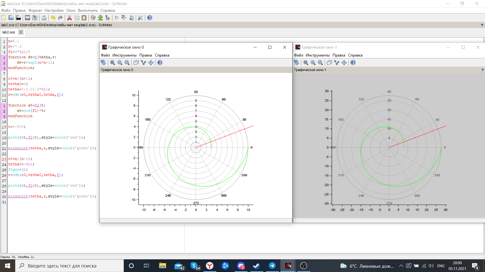
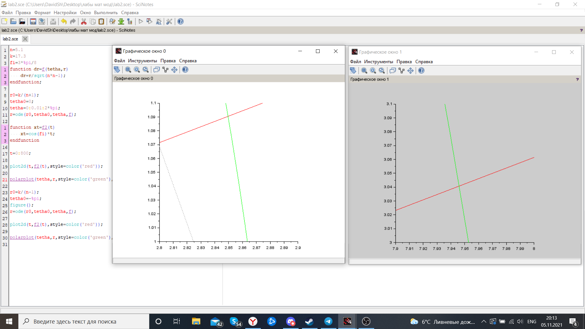

---
# Front matter
lang: ru-RU
title: "Лабораторная работа №2"
subtitle: "Решение задачи с браконьерами. Вариант 51"
author: "Шагабаев Давид, НПИбд-02-18"

# Formatting
toc-title: "Содержание"
toc: true # Table of contents
toc_depth: 2
lof: true # List of figures
lot: true # List of tables
fontsize: 12pt
linestretch: 1.5
papersize: a4paper
documentclass: scrreprt
polyglossia-lang: russian
polyglossia-otherlangs: english
mainfontoptions: Ligatures=TeX
romanfontoptions: Ligatures=TeX
sansfontoptions: Ligatures=TeX,Scale=MatchLowercase
monofontoptions: Scale=MatchLowercase
indent: true
pdf-engine: lualatex
header-includes:
  - \linepenalty=10 # the penalty added to the badness of each line within a paragraph (no associated penalty node) Increasing the value makes tex try to have fewer lines in the paragraph.
  - \interlinepenalty=0 # value of the penalty (node) added after each line of a paragraph.
  - \hyphenpenalty=50 # the penalty for line breaking at an automatically inserted hyphen
  - \exhyphenpenalty=50 # the penalty for line breaking at an explicit hyphen
  - \binoppenalty=700 # the penalty for breaking a line at a binary operator
  - \relpenalty=500 # the penalty for breaking a line at a relation
  - \clubpenalty=150 # extra penalty for breaking after first line of a paragraph
  - \widowpenalty=150 # extra penalty for breaking before last line of a paragraph
  - \displaywidowpenalty=50 # extra penalty for breaking before last line before a display math
  - \brokenpenalty=100 # extra penalty for page breaking after a hyphenated line
  - \predisplaypenalty=10000 # penalty for breaking before a display
  - \postdisplaypenalty=0 # penalty for breaking after a display
  - \floatingpenalty = 20000 # penalty for splitting an insertion (can only be split footnote in standard LaTeX)
  - \raggedbottom # or \flushbottom
  - \usepackage{float} # keep figures where there are in the text
  - \floatplacement{figure}{H} # keep figures where there are in the text
---

# Вариант 51

На море в тумане катер береговой охраны преследует лодку браконьеров. Через определенный промежуток времени туман рассеивается, и лодка обнаруживается на расстоянии 17,3 км от катера. Затем лодка снова скрывается в тумане и уходит прямолинейно в неизвестном направлении. Известно, что скорость катера в 5,1 раза больше скорости браконьерской лодки. 

1. Запишите уравнение, описывающее движение катера, с начальными условиями для двух случаев (в зависимости от расположения катера относительно лодки в начальный момент времени). 
2. Постройте траекторию движения катера и лодки для двух случаев. 
3. Найдите точку пересечения траектории катера и лодки 

# Выполнение лабораторной работы

1. Чтобы найти расстояние x (расстояние после которого катер начнет двигаться вокруг полюса), необходимо составить простое уравнение. Пусть через время t катер и лодка окажутся на одном расстоянии x от полюса. За это время лодка пройдет x , а катер k - x  (или k + x  , в зависимости от начального положения катера относительно полюса). Время, за которое они пройдут это расстояние, вычисляется как x / v или k - x / 2v (во втором  случае k + x / 2v ). Так как время одно и то же, то эти величины одинаковы. Тогда неизвестное расстояние x можно найти из следующего уравнения: 

  x / v = (k - x) / 2v(первый случай)

  x / v = (k + x) / 2v(второй случай)

  

  Код программы:

  ```
  n=5.1
  k=17.3
  fi=3*%pi/8
  function dr=f(tetha, r)
      dr=r/sqrt(n*n-1);
  endfunction;
  
  r0=k/(n+1);
  tetha0=0;
  tetha=0:0.01:2*%pi;
  r=ode(r0,tetha0,tetha,f);
  
  function xt=f2(t)
      xt=cos(fi)*t;
  endfunction
  
  t=0:800;
  
  plot2d(t,f2(t),style=color('red'));
  
  polarplot(tetha,r,style=color('green'), rect=[2.8,1,2.9,1.1]);
  
  r0=k/(n-1);
  tetha0=-%pi;
  figure();
  r=ode(r0,tetha0,tetha,f);
  
  plot2d(t,f2(t),style=color('red'));
  
  polarplot(tetha,r,style=color('green'), rect=[7.9,3,8,3.1]);
  ```

  2. Графики траектории движения катера и лодки для двух случаев: (рис. -@fig:001)


{ #fig:001 width=70% }

3. Точки пересечения траекторий катера и лодки: (рис. -@fig:002)

{ #fig:002 width=70% }

# Выводы

Задача решена.