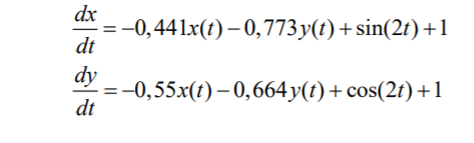
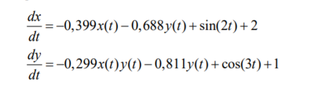
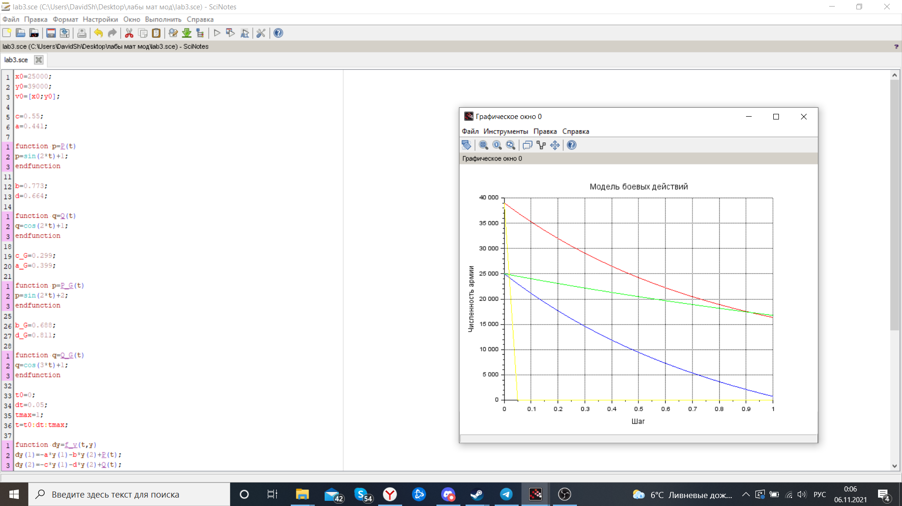

---
# Front matter
lang: ru-RU
title: "Лабораторная работа №3"
subtitle: " Задача модели боевых действий. Вариант 51"
author: "Шагабаев Давид, НПИбд-02-18"

# Formatting
toc-title: "Содержание"
toc: true # Table of contents
toc_depth: 2
lof: true # List of figures
lot: true # List of tables
fontsize: 12pt
linestretch: 1.5
papersize: a4paper
documentclass: scrreprt
polyglossia-lang: russian
polyglossia-otherlangs: english
mainfontoptions: Ligatures=TeX
romanfontoptions: Ligatures=TeX
sansfontoptions: Ligatures=TeX,Scale=MatchLowercase
monofontoptions: Scale=MatchLowercase
indent: true
pdf-engine: lualatex
header-includes:
  - \linepenalty=10 # the penalty added to the badness of each line within a paragraph (no associated penalty node) Increasing the value makes tex try to have fewer lines in the paragraph.
  - \interlinepenalty=0 # value of the penalty (node) added after each line of a paragraph.
  - \hyphenpenalty=50 # the penalty for line breaking at an automatically inserted hyphen
  - \exhyphenpenalty=50 # the penalty for line breaking at an explicit hyphen
  - \binoppenalty=700 # the penalty for breaking a line at a binary operator
  - \relpenalty=500 # the penalty for breaking a line at a relation
  - \clubpenalty=150 # extra penalty for breaking after first line of a paragraph
  - \widowpenalty=150 # extra penalty for breaking before last line of a paragraph
  - \displaywidowpenalty=50 # extra penalty for breaking before last line before a display math
  - \brokenpenalty=100 # extra penalty for page breaking after a hyphenated line
  - \predisplaypenalty=10000 # penalty for breaking before a display
  - \postdisplaypenalty=0 # penalty for breaking after a display
  - \floatingpenalty = 20000 # penalty for splitting an insertion (can only be split footnote in standard LaTeX)
  - \raggedbottom # or \flushbottom
  - \usepackage{float} # keep figures where there are in the text
  - \floatplacement{figure}{H} # keep figures where there are in the text
---

# Вариант 51

Между страной Х и страной У идет война. Численность состава войск исчисляется от начала войны, и являются временными функциями x(t) и y(t). В начальный момент времени страна Х имеет армию численностью 25 000 человек, а в распоряжении страны У армия численностью в 39 000 человек. Для упрощения модели считаем, что коэффициенты a, b, c, h постоянны. Также считаем P(t) и Q (t) непрерывные функции. Постройте графики изменения численности войск армии Х и армии У для следующих случаев: 

1. Модель боевых действий между регулярными войсками

   { #fig:001 width=70% }

2. Модель ведение боевых действий с участием регулярных войск и партизанских отрядов

   { #fig:002 width=70% }

   

# Выполнение лабораторной работы

Код программы:

```
x0=25000;
y0=39000;
v0=[x0;y0];

c=0.55;
a=0.441;

function p=P(t)
p=sin(2*t)+1;
endfunction

b=0.773;
d=0.664;

function q=Q(t)
q=cos(2*t)+1;
endfunction

c_G=0.299;
a_G=0.399;

function p=P_G(t)
p=sin(2*t)+2;
endfunction

b_G=0.688;
d_G=0.811;

function q=Q_G(t)
q=cos(3*t)+1;
endfunction

t0=0;
dt=0.05;
tmax=1;
t=t0:dt:tmax;

function dy=f_y(t,y)
dy(1)=-a*y(1)-b*y(2)+P(t);
dy(2)=-c*y(1)-d*y(2)+Q(t);
endfunction

y=ode(v0,t0,t,f_y);

function dy=f_y_G(t,y_G)
dy(1)=-a_G*y_G(1)-b_G*y_G(2)+P_G(t);
dy(2)=-c_G*y_G(1)*y_G(2)-d_G*y_G(2)+Q_G(t);
endfunction

y_G=ode(v0,t0,t,f_y_G);

//Graphic
plot2d(t,y(1,:),style=color('blue'));
plot2d(t,y(2,:),style=color('red'));

plot2d(t,y_G(1,:),style=color('green'));
plot2d(t,y_G(2,:),style=color('yellow'));

xtitle('Модель боевых действий','Шаг','Численность армии');
xgrid();
```

{ #fig:003 width=70% }


# Выводы

Задача решена.