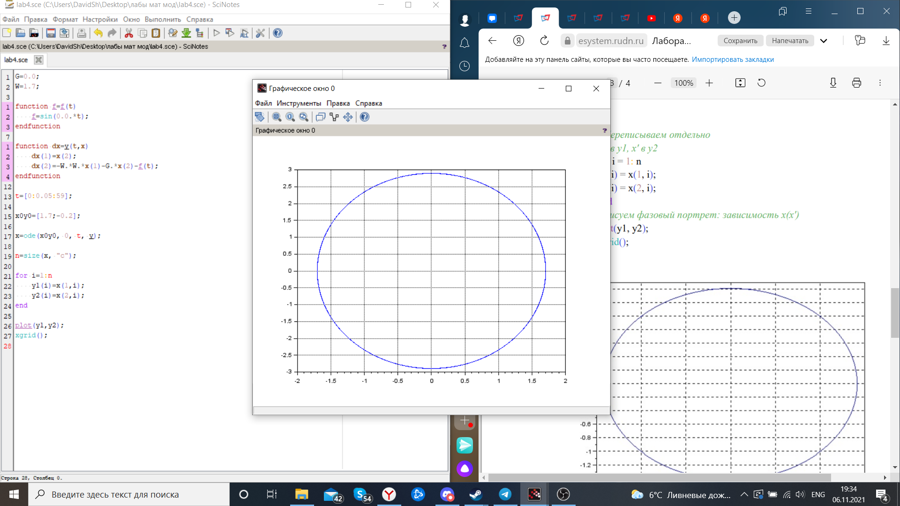
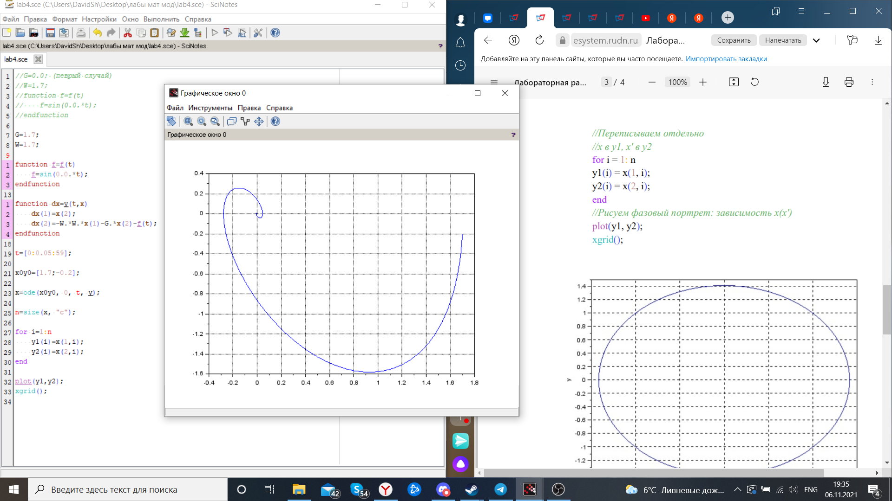
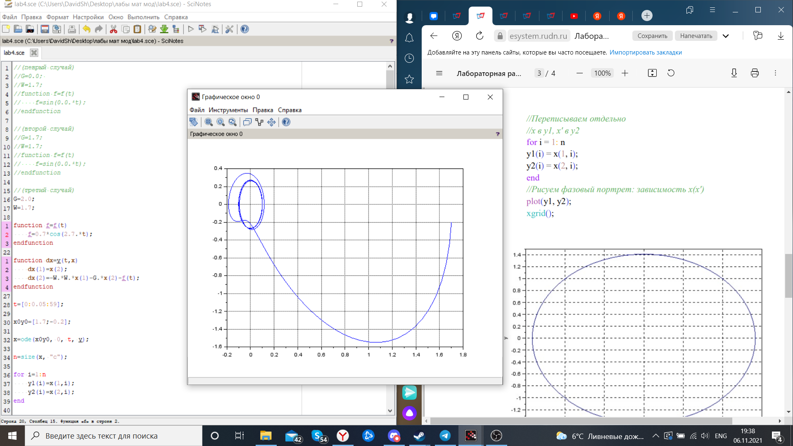

---
# Front matter
lang: ru-RU
title: "Лабораторная работа №4"
subtitle: " Задача Модель гармонических колебаний. Вариант 51"
author: "Шагабаев Давид, НПИбд-02-18"

# Formatting
toc-title: "Содержание"
toc: true # Table of contents
toc_depth: 2
lof: true # List of figures
lot: true # List of tables
fontsize: 12pt
linestretch: 1.5
papersize: a4paper
documentclass: scrreprt
polyglossia-lang: russian
polyglossia-otherlangs: english
mainfontoptions: Ligatures=TeX
romanfontoptions: Ligatures=TeX
sansfontoptions: Ligatures=TeX,Scale=MatchLowercase
monofontoptions: Scale=MatchLowercase
indent: true
pdf-engine: lualatex
header-includes:
  - \linepenalty=10 # the penalty added to the badness of each line within a paragraph (no associated penalty node) Increasing the value makes tex try to have fewer lines in the paragraph.
  - \interlinepenalty=0 # value of the penalty (node) added after each line of a paragraph.
  - \hyphenpenalty=50 # the penalty for line breaking at an automatically inserted hyphen
  - \exhyphenpenalty=50 # the penalty for line breaking at an explicit hyphen
  - \binoppenalty=700 # the penalty for breaking a line at a binary operator
  - \relpenalty=500 # the penalty for breaking a line at a relation
  - \clubpenalty=150 # extra penalty for breaking after first line of a paragraph
  - \widowpenalty=150 # extra penalty for breaking before last line of a paragraph
  - \displaywidowpenalty=50 # extra penalty for breaking before last line before a display math
  - \brokenpenalty=100 # extra penalty for page breaking after a hyphenated line
  - \predisplaypenalty=10000 # penalty for breaking before a display
  - \postdisplaypenalty=0 # penalty for breaking after a display
  - \floatingpenalty = 20000 # penalty for splitting an insertion (can only be split footnote in standard LaTeX)
  - \raggedbottom # or \flushbottom
  - \usepackage{float} # keep figures where there are in the text
  - \floatplacement{figure}{H} # keep figures where there are in the text
---

# Вариант 51

Постройте фазовый портрет гармонического осциллятора и решение уравнения гармонического осциллятора для следующих случаев 

1. Колебания гармонического осциллятора без затуханий и без действий внешней силы x"+1.7x=0

2. Колебания гармонического осциллятора c затуханием и без действий внешней силы x"+1.7x'+1.7x=0

3. Колебания гармонического осциллятора c затуханием и под действием внешней силы x"+2x'+1.7x=0.7cos(2.7t)

   На интервале t∈[0; 59] (шаг 0.05) с начальными условиями x(0)=1.7, y(0)=-0.2


# Выполнение лабораторной работы

Код программы:

```
//(певрый случай)
//G=0.0; 
//W=1.7;
//function f=f(t)
//    f=sin(0.0.*t);
//endfunction

//(второй случай)
//G=1.7;
//W=1.7;
//function f=f(t)
//    f=sin(0.0.*t);
//endfunction

//(третий случай)
G=2.0;
W=1.7;

function f=f(t)
    f=0.7*cos(2.7.*t);
endfunction

function dx=y(t,x)
    dx(1)=x(2);
    dx(2)=-W.*W.*x(1)-G.*x(2)-f(t);
endfunction

t=[0:0.05:59];

x0y0=[1.7;-0.2];

x=ode(x0y0, 0, t, y);

n=size(x, "c");

for i=1:n
    y1(i)=x(1,i);
    y2(i)=x(2,i);
end

plot(y1,y2);
xgrid();
```

{ #fig:001 width=70% }

{ #fig:002 width=70% }

{ #fig:003 width=70% }

# Выводы

Задача решена.