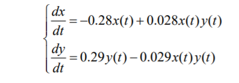

---
# Front matter
lang: ru-RU
title: "Лабораторная работа №5"
subtitle: " Задача модели «хищник-жертва». Вариант 51"
author: "Шагабаев Давид, НПИбд-02-18"

# Formatting
toc-title: "Содержание"
toc: true # Table of contents
toc_depth: 2
lof: true # List of figures
lot: true # List of tables
fontsize: 12pt
linestretch: 1.5
papersize: a4paper
documentclass: scrreprt
polyglossia-lang: russian
polyglossia-otherlangs: english
mainfontoptions: Ligatures=TeX
romanfontoptions: Ligatures=TeX
sansfontoptions: Ligatures=TeX,Scale=MatchLowercase
monofontoptions: Scale=MatchLowercase
indent: true
pdf-engine: lualatex
header-includes:
  - \linepenalty=10 # the penalty added to the badness of each line within a paragraph (no associated penalty node) Increasing the value makes tex try to have fewer lines in the paragraph.
  - \interlinepenalty=0 # value of the penalty (node) added after each line of a paragraph.
  - \hyphenpenalty=50 # the penalty for line breaking at an automatically inserted hyphen
  - \exhyphenpenalty=50 # the penalty for line breaking at an explicit hyphen
  - \binoppenalty=700 # the penalty for breaking a line at a binary operator
  - \relpenalty=500 # the penalty for breaking a line at a relation
  - \clubpenalty=150 # extra penalty for breaking after first line of a paragraph
  - \widowpenalty=150 # extra penalty for breaking before last line of a paragraph
  - \displaywidowpenalty=50 # extra penalty for breaking before last line before a display math
  - \brokenpenalty=100 # extra penalty for page breaking after a hyphenated line
  - \predisplaypenalty=10000 # penalty for breaking before a display
  - \postdisplaypenalty=0 # penalty for breaking after a display
  - \floatingpenalty = 20000 # penalty for splitting an insertion (can only be split footnote in standard LaTeX)
  - \raggedbottom # or \flushbottom
  - \usepackage{float} # keep figures where there are in the text
  - \floatplacement{figure}{H} # keep figures where there are in the text
---

# Вариант 51

{ #fig:001 width=70% }

Постройте график зависимости численности хищников от численности жертв, а также графики изменения численности хищников и численности жертв при следующих начальных условиях: x(0)=7, y(0)=21. Найдите стационарное состояние системы.


# Выполнение лабораторной работы

Код программы:

```
a=0.28;
b=0.29;
c=0.028;
d=0.029;

t=[0:0.1:400];
x0y0=[21;7];

function dxdy=x_der(t,x)
    dxdy(1)=b*x(1)-d*x(1)*x(2);
    dxdy(2)=-a*x(2)+c*x(1)*x(2);
endfunction

x=ode(x0y0,0,t,x_der);

n=size(x,"c");
for i=1:n
    x_der1(i)=x(1,i);
    x_der2(i)=x(2,i);
end

//plot(t,x_der1);
//plot(t,x_der2);
//plot(x_der1,x_der2);
```

{ #fig:002 width=70% }

{ #fig:003 width=70% }

{ #fig:004 width=70% }

# Выводы

Задача решена.