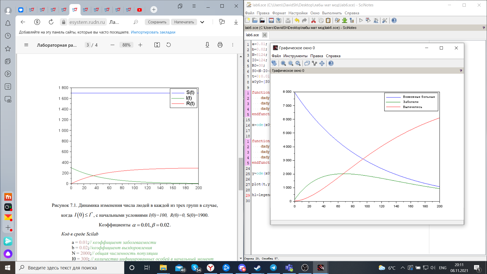

---
# Front matter
lang: ru-RU
title: "Лабораторная работа №6"
subtitle: " Задача об эпидемии. Вариант 51"
author: "Шагабаев Давид, НПИбд-02-18"

# Formatting
toc-title: "Содержание"
toc: true # Table of contents
toc_depth: 2
lof: true # List of figures
lot: true # List of tables
fontsize: 12pt
linestretch: 1.5
papersize: a4paper
documentclass: scrreprt
polyglossia-lang: russian
polyglossia-otherlangs: english
mainfontoptions: Ligatures=TeX
romanfontoptions: Ligatures=TeX
sansfontoptions: Ligatures=TeX,Scale=MatchLowercase
monofontoptions: Scale=MatchLowercase
indent: true
pdf-engine: lualatex
header-includes:
  - \linepenalty=10 # the penalty added to the badness of each line within a paragraph (no associated penalty node) Increasing the value makes tex try to have fewer lines in the paragraph.
  - \interlinepenalty=0 # value of the penalty (node) added after each line of a paragraph.
  - \hyphenpenalty=50 # the penalty for line breaking at an automatically inserted hyphen
  - \exhyphenpenalty=50 # the penalty for line breaking at an explicit hyphen
  - \binoppenalty=700 # the penalty for breaking a line at a binary operator
  - \relpenalty=500 # the penalty for breaking a line at a relation
  - \clubpenalty=150 # extra penalty for breaking after first line of a paragraph
  - \widowpenalty=150 # extra penalty for breaking before last line of a paragraph
  - \displaywidowpenalty=50 # extra penalty for breaking before last line before a display math
  - \brokenpenalty=100 # extra penalty for page breaking after a hyphenated line
  - \predisplaypenalty=10000 # penalty for breaking before a display
  - \postdisplaypenalty=0 # penalty for breaking after a display
  - \floatingpenalty = 20000 # penalty for splitting an insertion (can only be split footnote in standard LaTeX)
  - \raggedbottom # or \flushbottom
  - \usepackage{float} # keep figures where there are in the text
  - \floatplacement{figure}{H} # keep figures where there are in the text
---

# Вариант 51

На одном острове вспыхнула эпидемия. Известно, что из всех проживающих на острове (N=8124) в момент начала эпидемии (t=0) число заболевших людей (являющихся распространителями инфекции) I(0)=124, А число здоровых людей с иммунитетом к болезни R(0)=30. Таким образом, число людей восприимчивых к болезни, но пока здоровых, в начальный момент времени S(0)=N-I(0)- R(0). Постройте графики изменения числа особей в каждой из трех групп. Рассмотрите, как будет протекать эпидемия в случае: 

1) если I(0)=<I
2) если I(0)>I


# Выполнение лабораторной работы

Код программы:

```
a=0.01;
b=0.02;
N=8124;
I0=124;
R0=30;
S0=N-I0-R0;
t=0:0.01:200;
x0y0=[S0;I0;R0];

function dxdy=x_der(t,x)
    dxdy(1)=0;
    dxdy(2)=-b*x(2);
    dxdy(3)=b*x(2);
endfunction

x=ode(x0y0, 0, t, x_der);


function dxdy=y_der(t,x)
    dxdy(1)=-a*x(1);
    dxdy(2)=a*x(1)-b*x(2);
    dxdy(3)=b*x(2);
endfunction

y=ode(x0y0, 0, t, y_der);

plot(t,y);

h1=legend(['Возможные больные';'Заболели';'Вылечились']);
```

{ #fig:001 width=70% }


# Выводы

Задача решена.