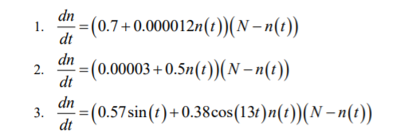
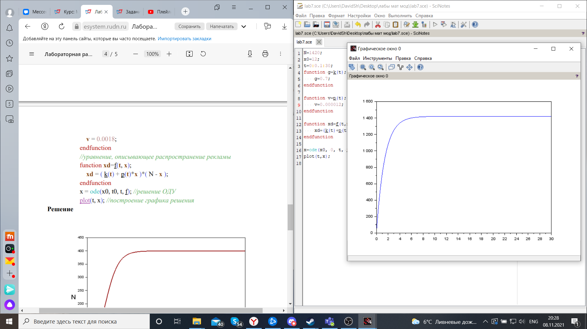
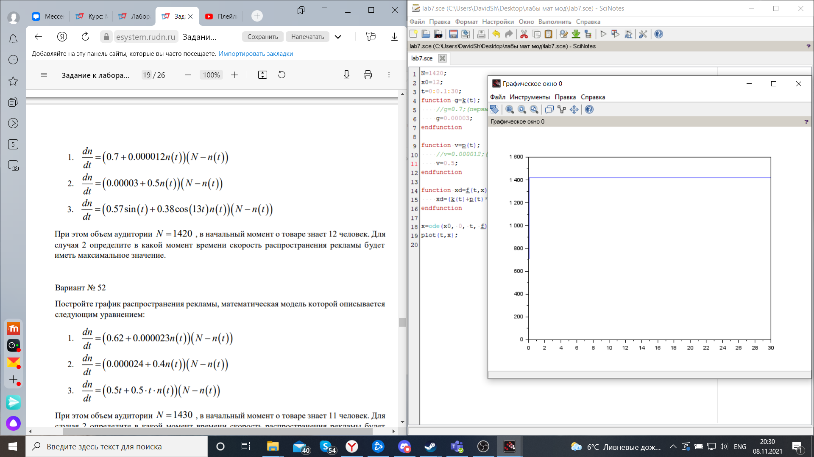
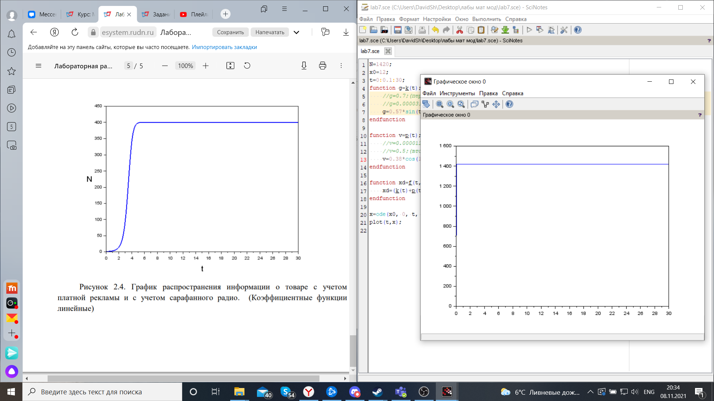

---
# Front matter
lang: ru-RU
title: "Лабораторная работа №7"
subtitle: " Задача "Эффективность рекламы". Вариант 51"
author: "Шагабаев Давид, НПИбд-02-18"

# Formatting
toc-title: "Содержание"
toc: true # Table of contents
toc_depth: 2
lof: true # List of figures
lot: true # List of tables
fontsize: 12pt
linestretch: 1.5
papersize: a4paper
documentclass: scrreprt
polyglossia-lang: russian
polyglossia-otherlangs: english
mainfontoptions: Ligatures=TeX
romanfontoptions: Ligatures=TeX
sansfontoptions: Ligatures=TeX,Scale=MatchLowercase
monofontoptions: Scale=MatchLowercase
indent: true
pdf-engine: lualatex
header-includes:
  - \linepenalty=10 # the penalty added to the badness of each line within a paragraph (no associated penalty node) Increasing the value makes tex try to have fewer lines in the paragraph.
  - \interlinepenalty=0 # value of the penalty (node) added after each line of a paragraph.
  - \hyphenpenalty=50 # the penalty for line breaking at an automatically inserted hyphen
  - \exhyphenpenalty=50 # the penalty for line breaking at an explicit hyphen
  - \binoppenalty=700 # the penalty for breaking a line at a binary operator
  - \relpenalty=500 # the penalty for breaking a line at a relation
  - \clubpenalty=150 # extra penalty for breaking after first line of a paragraph
  - \widowpenalty=150 # extra penalty for breaking before last line of a paragraph
  - \displaywidowpenalty=50 # extra penalty for breaking before last line before a display math
  - \brokenpenalty=100 # extra penalty for page breaking after a hyphenated line
  - \predisplaypenalty=10000 # penalty for breaking before a display
  - \postdisplaypenalty=0 # penalty for breaking after a display
  - \floatingpenalty = 20000 # penalty for splitting an insertion (can only be split footnote in standard LaTeX)
  - \raggedbottom # or \flushbottom
  - \usepackage{float} # keep figures where there are in the text
  - \floatplacement{figure}{H} # keep figures where there are in the text
---

# Вариант 51

Постройте график распространения рекламы, математическая модель которой описывается следующим уравнением:

{ #fig:001 width=70% }

При этом объем аудитории N = 1420 , в начальный момент о товаре знает 12 человек. Для случая 2 определите в какой момент времени скорость распространения рекламы будет иметь максимальное значение.

# Выполнение лабораторной работы

Код программы:

```
N=1420;
x0=12;
t=0:0.1:30;
function g=k(t);
    //g=0.7;//(первый случай)
    //g=0.00003;//(второй случай)
    g=0.57*sin(t);//(третий случай)
endfunction

function v=p(t);
    //v=0.000012;//(первый случай)
    //v=0.5;//(второй случай)
    v=0.38*cos(13*t);//(третий случай)
endfunction

function xd=f(t, x);
    xd=(k(t)+p(t)*x)*(N-x);
endfunction

x=ode(x0, 0, t, f);
plot(t,x);
```

{ #fig:002 width=70% }

{ #fig:003 width=70% }

{ #fig:004 width=70% }

# Выводы

Задача решена.