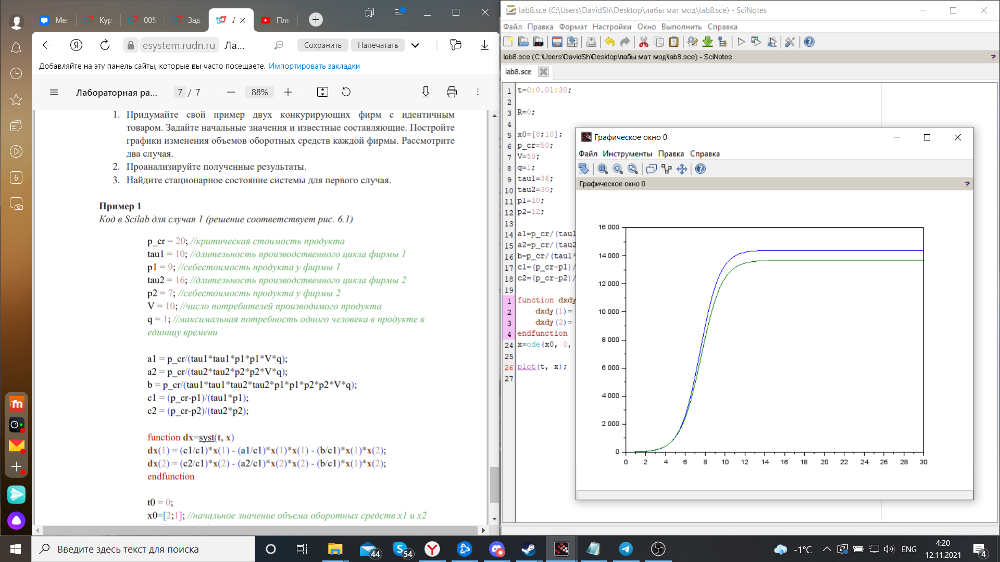
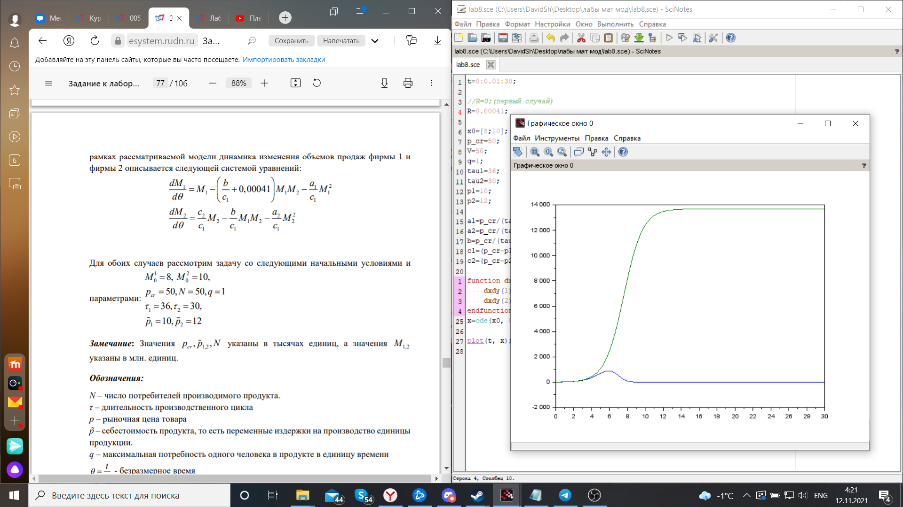

---
# Front matter
lang: ru-RU
title: "Лабораторная работа №8"
subtitle: " Задача модели конкуренции двух фирм. Вариант 51"
author: "Шагабаев Давид, НПИбд-02-18"

# Formatting
toc-title: "Содержание"
toc: true # Table of contents
toc_depth: 2
lof: true # List of figures
lot: true # List of tables
fontsize: 12pt
linestretch: 1.5
papersize: a4paper
documentclass: scrreprt
polyglossia-lang: russian
polyglossia-otherlangs: english
mainfontoptions: Ligatures=TeX
romanfontoptions: Ligatures=TeX
sansfontoptions: Ligatures=TeX,Scale=MatchLowercase
monofontoptions: Scale=MatchLowercase
indent: true
pdf-engine: lualatex
header-includes:
  - \linepenalty=10 # the penalty added to the badness of each line within a paragraph (no associated penalty node) Increasing the value makes tex try to have fewer lines in the paragraph.
  - \interlinepenalty=0 # value of the penalty (node) added after each line of a paragraph.
  - \hyphenpenalty=50 # the penalty for line breaking at an automatically inserted hyphen
  - \exhyphenpenalty=50 # the penalty for line breaking at an explicit hyphen
  - \binoppenalty=700 # the penalty for breaking a line at a binary operator
  - \relpenalty=500 # the penalty for breaking a line at a relation
  - \clubpenalty=150 # extra penalty for breaking after first line of a paragraph
  - \widowpenalty=150 # extra penalty for breaking before last line of a paragraph
  - \displaywidowpenalty=50 # extra penalty for breaking before last line before a display math
  - \brokenpenalty=100 # extra penalty for page breaking after a hyphenated line
  - \predisplaypenalty=10000 # penalty for breaking before a display
  - \postdisplaypenalty=0 # penalty for breaking after a display
  - \floatingpenalty = 20000 # penalty for splitting an insertion (can only be split footnote in standard LaTeX)
  - \raggedbottom # or \flushbottom
  - \usepackage{float} # keep figures where there are in the text
  - \floatplacement{figure}{H} # keep figures where there are in the text
---

# Вариант 51

Рассмотрим две фирмы, производящие взаимозаменяемые товары одинакового качества и находящиеся в одной рыночной нише. Считаем, что в рамках нашей модели конкурентная борьба ведётся только рыночными методами. То есть, конкуренты могут влиять на противника путем изменения параметров своего производства: себестоимость, время цикла, но не могут прямо вмешиваться в ситуацию на рынке («назначать» цену или влиять на потребителей каким-либо иным способом.) 
в первом случае R=0

во втором случае R=0,00041

# Выполнение лабораторной работы

Код программы:

```
t=0:0.01:30;

//R=0;(первый случай)
R=0.00041;//(второй случай)

x0=[8;10];
p_cr=50;
V=50;
q=1;
tau1=36;
tau2=30;
p1=10;
p2=12;

a1=p_cr/(tau1*tau1* p1*p1* V* q);
a2=p_cr/(tau2*tau2* p2*p2* V* q);
b=p_cr/(tau1*tau1*tau2*tau2* p1*p1* p2*p2* V * q);
c1=(p_cr-p1)/(tau1*p1);
c2=(p_cr-p2)/(tau2*p2);

function dxdy=syst(t, x)
    dxdy(1)= x(1)-((b/c1)+R)* x(1)*x(2)-(a1/c1)* x(1)*x(1);
    dxdy(2)= (c2/c1)*x(2)-(b/c1)*x(1)*x(2)-(a2/c1)*x(2)*x(2);
endfunction
x=ode(x0, 0, t, syst);

plot(t, x);
```

{ #fig:001 width=70% }

{ #fig:002 width=70% }


# Выводы

Задача решена.